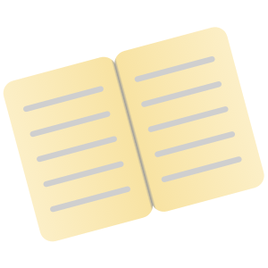
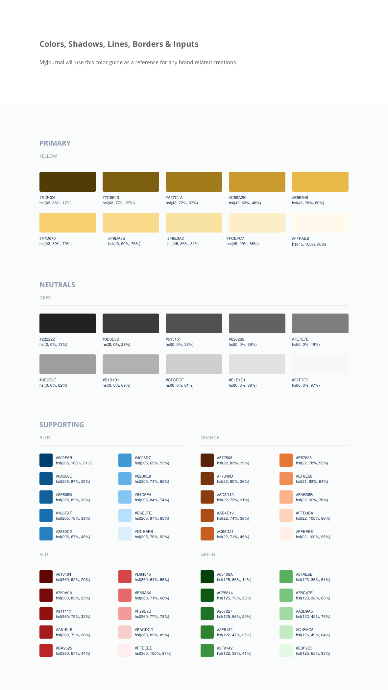
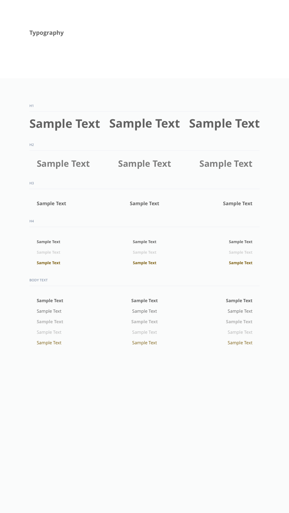

# myJournal
<p align="center">
	
</p>

## Table of Contents 
* [General Info](#general-info)
	* [Built With](#built-with)
* [Getting Started](#setup)
	* [Installation](#installation)
	* [Login Details ](#login-details )
* [Contact](#contact)
* [Design](#design)
	* [Logos](#logos)
	* [Palette](#palette)
	* [Pages](#pages)


## General Info 
- An online morning and evening journal that is free and secure
- All design materials can be found in **sketch file** in design folder.
- [URL](https://myjournalapp.netlify.app/) 


#### Built With
- [ReactJS](https://reactjs.org/) (Hooks)
- [Redux](https://redux.js.org/)
- [Node](https://nodejs.org/en/)
- [Express](https://expressjs.com/)
- [SQLite](https://sqlite.org/index.html)
- [Sass](https://sass-lang.com/)
- [Sketch](https://www.sketch.com/)


## Getting Started
#### Installation 
- Server-Side 
	- Go to root project folder and run ```npm install ```


- Client-Side
	- Go to client folder and run ```npm install ```

- Design File
	- Open with Sketch

#### Login Details 
- To view a pre-existing journal page
	- **Username:** 
	- **Password:**

	

## Contact
- Aman Singh - <a href="mailto:amsingh714@gmail.com?subject=Hi,%20I'm%20interested%20in%20connecting.">
amsingh714@gmail.com </a>
- [Portfolio](https://amans.dev/) 
- [Resume](https://docs.google.com/document/d/1cI3QMFkF_pVxEqDeQqFSTy0TB9Y-vu3_BrD4N1qXLeU/edit)


## Design
#### Logos
- Logos designed for project
	- Main Logo
	
		
		
	- Secondary Logo
		
		

 
#### Palettes
- Color Palette


- Typography

